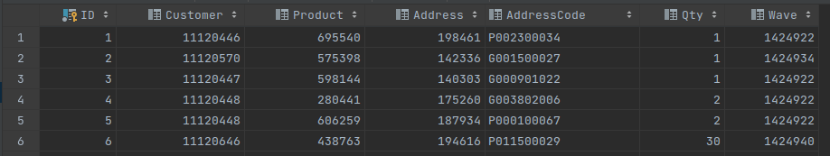
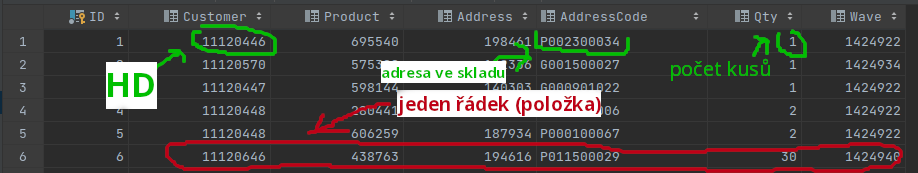
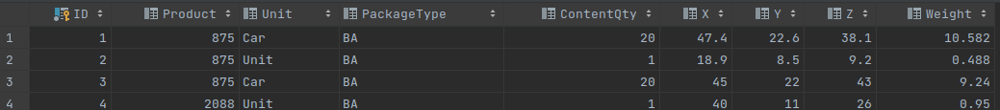

Plán procesu a jednotlivých náležitostí
===
- V systému je provedeno N objednávek, po čase T (odpovídající tomu, že systém vyhodnotí dostatečnou naplňenost, či podle jiného kritéria *(pro mě nepodstatné)* ) dojde k `zavlnění` - v této fázi jsou vytvořeny **dávky** (dále **HD** - Hromadný Dodací list - toto označení pro mě znamená jednoho zákazníka a zjednodušení pojmu dávka) a jednotlivým produktům je **přidělena adresa**; prodejní doklady na **stejného zákazníka a stejnou dodací adresu** jsou spojeny do jednoho **HD**. Výsledná data jsou odeslána mému algoritmu.
- *Aktuálně systém pokračuje rozřazením HD do vozíků tak, že zohledňuje pouze objem, počet přihrádek ve vozíku (8) a kritérium nedělitelnosti zákazníka. Lidé pak chodí s vozíkem podle fixně řazeného seznamu adres.*

- Vstupem mého algoritmu (přesněji mého výpočtu) jsou položky (vázané na zákazníky), které mám vychystat - *"jeden řádek - jedno místo ve skladu - 1+ kusů zboží - 1+ přepravek na vozíku"*
- Položky jsou ve formátu (představa - databázová tabulka, jejíž sloupce teď vypíšu)
  - HD (Alza Praha 3, CZC Opava, COMFOR Poruba Hlavní třída,...)
  - Položka (Lenovo IdeaPad AX, Apple MacBook Pro 10, ThinkPad T150,...)
  - Počet kusů produktu (1, 5, 20,...)
  - Adresa (G000159545, PO10494564,...) určující místo na skladě
  - a dále viz screenshot
 - vysvětlení zde:

- K těmto řádkům (položkám) mám k dispozici informace o produktech k nim (řádkům) náležícím

  - Tyto informace potřebuji především pro výpočet objemu, abych následně věděl jak to vyskládat do vozíku a kolik přepravek bude třeba.

- **Pravidla**
  - Jeden zákazník (objednávky od jednoho zákazník na stejné adrese spojené do HD) je nedělitelný mezi vozíky
  - Vozík má devět přepravek
  - Zboží mající větší rozměry, než se vejde do přepravky musí být stejně vychystáno
  - Jedna přepravka může obsahovat zboží pouze od jednoho zákazníka (ten samozřejmě může být ve více přepravkách)
    - Jedna přepravka může obsahovat zboží od *více zákazníků*, pokud každé zboží je položka o jednom kusu

- **Cíl** 
  <pre>Naskládat co nejefektivněji HD do vozíků tak, aby tvořily celek s <b>nejkratší cestou</b> po skladu při <b>vytížení všech lidí</b> za splnění všech pravidel. Dále položky na vozíku seřadit do seznamu rovněž do co nejkratší trasy.</pre>

- **Statistiky**
  - Řeším prostor o cca 30000 adresách a 20000 produktech. 
  - Do algoritmu mi může přijít 1 položka i 2000 položek - pro vše se chovám stejně
  - Každému vozíku se přiřazovalo 8 HD
  - Nejvíce bývá aktivních 40 lidí (=40 vozíků) v sezóně, mimo sezónu 15 (=15 vozíků). 

- **Další info a poznámky**
  - Rozměry přepravky 28x42x18 cm

 

Fáze algoritmu po příjmu dat po `zavlnění`
- proměnná X počet vychystávačů - dispečer kontrolující mechanismus zavlnění tuto proměnnou vždy zadá
1. Seskupení položek podle zákazníků
2. Vypočítání objemů jednotlivých položek (`řádků`) a přiřazení k nim *(dostanu k dispozici firmou zatím používaný algoritmus)*
3. Procházení `HD`
   1. Pokud `HD` *(zákazník)* má tolik položek, že zaplní celý vozík - **HOTOVO**
   2. Jinak hledání takového zákazníka či více zákazníků, kteří doplní zbylé místo na vozíku **(Zde nastává prostor pro můj algoritmus)**
4. Procházení seznamů pro jednotlivé vozíky a řazení adres do nejkratší cesty (TSP problém)
5. Návrat listu seřazených seznamů `řádků` pro jednotlivé vozíky

