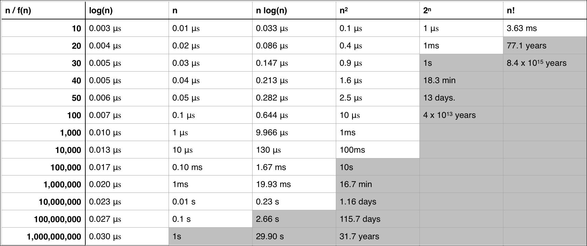

Poznámky a popis vzniku base-line algoritmu a návrhy možného řešení
===
# Logistika ve skladu
Skladová logistika je velmi komplexní obor. Její složitost a propracovanost se obvykle odvíjí od zkušeností, které mají dané firmy, její velikostí a počtem produktů, které je třeba uskladnit až po finanční možnosti, které lze investovat do organizace a fungování skladu. Fungování skladu, u kterého uvažujeme propojení s elektornickým systémem firmy, můžeme rozdělit do čtyř základních úrovní:
1. Malý sklad s nízkým počtem položek. Zaměstnanci se umí orientovat po paměti a žádné skladové adresy nejsou potřeba. Zboží je organizováno v některých případech nejvýše do nějákých logických celků, popřípadě můžem být popsáno. Propojení zboží vedeného v systému firmy a jeho uložení na skladě neexistuje.
2. Sklad větších rozměrů se středním počtem zboží - je v něm přinejmenším obtížné orientovat se po paměti či s nepřenými označeními lokací jednotlivých položek. Proto taková firma velmi často volí implementaci WMS (Warehouse Management System). Ve skladu se zvolí adresový systém (způsob organizace a konvence zápisu adres). Ten se potom využije způsobem, že každá položka již má v elektronickém systému vedenu i její adresu na skladu, kde se nachází. Zaměstnanci ovšem stále nepoužívají elektronická zařízení.
3. Velký sklad s vysokým počtem zboží - ačkoli již má implementovaný WMS a tudíž je organizován podle adres, zaměstnanci ve většině případů používají tužku a papír během své práce, která sestává většinou z činností 
   - během příjmu zboží do skladu - "vezmi položku a zařaď ji na sklad"   
   - během exportu zboží ze skladu - "najdi položku na skladu a přines"
přičemž je neustále nutné veškeré akce nejprve provést a následně je i registrovat do systému, což bývá náchylné k chybám. Proto je zavedeno používání elektroniky pro zjednodušení výše nastíněné práce. Tímto je zajištěno, že změny týkající se zboží, které provede pracovník, jsou v reálném čase provedeny i v elektronickém systému. \
Používaná zařízení (velmi často čtečky) navíc mohou sloužit i pro zrychlování práce, například možností načítat kódy požadovaného zboží právě díky použití čtečky.
4. Skladové prostory firem s miliardovými obraty - zde již je práce velmi efektivně řízena, nicméně začíná se utvářet prostor pro použití automatizace ve formě robotů. Jejich zavedení brání ve většině případů nemožnost finanční návratnosti, právě kvůli malému obratu. Robot s sebou přináší výhodu jednorázové investice a ušetření množství lidí, které ovšem musí na druhou stranu být dostatečně velké na to, aby byl robot v - pro firmu únosné - době splacen. Příkladem takové automatizace může být využití paletových či balících robotů.

# Logistické problémy
Logistika je obor, kde se ve velkém množství uplatňují optimalizační procesy, které mají sloužit pro zrychlení procesů, úsporu zaměstnanců či zvýšení produktivity na skladech. Mnoho z problémů jsou již známé z historie - patří mezi ně slavný *Problém obchodního cestujícího* či *Problém čínského listonoše*. Některé jsou novodobého rázu - například *Bin packing problem* nebo *Vehicle routing problem*.

- **Problém obchodního cestujícího (známý jako TSP - Travelling Salesman Problem)**  je prolémem, který řeší průchod skrz graf tak, aby žádný vrchol nebyl navštíven vícekrát (konkrténě se jednalo o obchodníka, který má navštívit všechna na seznamu tak, aby urazil co nejkratší vzdálenost a zároveň nenavštívil žádné město víc než jednou). Patří do kategorie NP-úplných problémů a tedy zatím nemá řešení pro libovolný počet uzlů. Aktuálně je tento problém řešen heuristikami, kterými je například algoritmus *Nejblížšího souseda (Nearest neighbour)*, či použitím genetických algoritmů.

    Tento problém úzce souvisí s problémem Hamiltonova cyklu - to je cyklus obsahující takovou cestu, na které lze všechny uzly navštívit právě jednou a navrátit se přitom do počátečního vrcholu. (cit. Wróblewski P. Algoritmy)*Pokud najdeme takový (tj. Hamiltonovský) cyklus s minimální sumou jeho hran, vyřešíme slavný problém obchodního cestujícího.*
- **Problém čínského listonoše (známý jako Chinese postman Problem)** je jakýmsi protějškem problému TSP - zabýváme se totiž při něm hledáním způsobu, jak navštívit všechny hrany daného grafu, a to tak, aby každá byla navštívena v ideálním případě jedenkrát - to je sice předem známo (takový graf by totiž musel být Eulerovským - tedy má všechny uzly sudého stupně a tudíž existuje uzavřený tah obsahující všechny hrany), nicméně je cílem tohoto dosáhnout.
- **Bin packing problem** opět spadá pod NP-úplné problémy, nicméně existuje řada heuristik pro jeho výpočet. Má mnoho podob, jejichž cílem je vždy poskládání N předmětů do prostoru (boxu) o dané kapacitě  K, či rozměrech X,Y,Z. Možnosti řešení jsou rozděleny od jednodušších ke složitějším. Z povahy problému jistě vidíme, že největší složitost budou mít algoritmy řešící druhou variantu, tedy skládání objektů do prostoru dle rozměrů.
  - Nejdříve se zaměřme na první variantu. Každý z N předmětů je definován veličinou X, X e R. Dále mějme P boxů, všechny o stejné maximální kapacitě (odpovídající veličině charakterizující předměty) K, K e R. Uveďme, že je nezbytnou podmínkou aby pro každé X náležející N platilo, že X(N) < K. Cílem je naplnit nejmenší možný počet boxů. **Tento typ problému zároveň využíváme v základním řešení bakalářské práce jako zjednodušení výpočtu s reálnými objemy**. Uveďme nyní dva algoritmy, které se zde používají:
    1. First fit - v cyklu bereme po řadě či náhodně předměty N a vkládáme je vždy zleva do boxů (seřazených zleva doprava) takto: 
       1. Pokud je box prázdný, potom tam lze objekt vložit. 
       2. Pokud je box neprázdný a zároveň suma veličin charakterizujících objekty v něm a objektu, který chceme přidat, je menší či rovna maximální kapacitě krabice, pak do ní vložíme objekt.
       3. Jinak opakujeme postup od kroku 1 pro následující box
    2. Best fit

# Problémy a jejich složitost
Pro výběr vhodného algotimu, či vícero algoritmů se musíme seznámit s hodnotícími kritérii.

Hodnocení kvality algoritmů se odvíjí od dvou základních bodů - časové a prostorové složitosti. Tyto dva parametry jsou ovlivňovány velikostí vstupních dat. Uveďme, že zatímco význam prostorové složitosti je s narůstající kapacitou výpočetních pamětí (a s tím i klesáním ceny za GB) umenšován, význam časové složitosti je obrovský, vezmeme-li v úvahu algoritmy, které mají odhadovaný čas nalezení řešení v řádu staletí. Časová složitost se nejčastěji odhadnuta jako součet časů (považovaných za konstantní) jednotlivých elementárních operací. Vždyc nás zajímá nejhorší možný scénář. 

Příliš náročné algoritmu (viz //TODO reference) je řešeno hledáním tzv. heuristik - algoritmů, které sice nezaručují nalezení optimálního řešení, zato umožňují najít vyhovující (podle předem stanoveného kritéria) řešení v polynomickém čase - takovém, kde existuje funkce představující horní ohraničení složitosti takového algoritmu pro daný počet vstupů //TODO math. T(n) = O(n^k) pro konstantu k>0.
## Asymptotická složitost
Nejvíce nás u algoritmů tedy zajímá asymptotická složitost - ta se vyjadřuje jako porovnáním algoritmu s jistou funkcí pro N limitně se blížící nekonečnu.
- Omikron - horní hranice chování - funkce F, pro kterou platí, že pro jakékoli F(y)>=
- Omega - dolní hranice chování
- Theta - třída chování

# Úvod do teorie grafů

# Principy optimalizace

# Přílohy
- [1]

# Zdroje
- [1] https://subscription.packtpub.com/book/application-development/9781785884504/8/ch08lvl1sec54/evaluating-runtime-complexity
- [2] Honzík,M J.: Algoritmy a datové struktury, 2018
