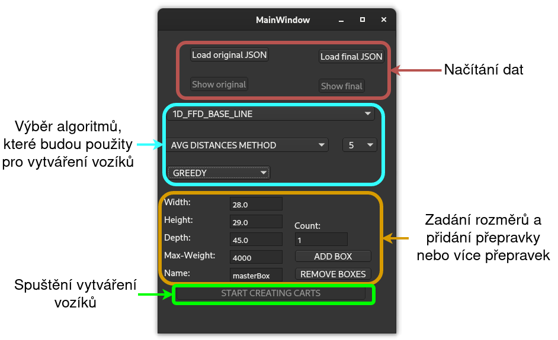

Optimalizace průchodu skladem
===
## Autor
jméno: Jan Holáň \
login: xholan11 \
email: xholan11@vutbr.cz

# Intro
Kód implementuje GUI pro testování funkčnosti knihovny řešící optimalizaci průchodu skladem.

# Závislosti
Kód je počítá s přítomností knihoven **python3.11** a **nlohmann/json**.

Knihovna **nlohmann/json** slouží pro práci se soubory typu JSON. Lze stáhnout z https://github.com/nlohmann/json, případně lze využít nějakou z možností viz https://json.nlohmann.me/integration/package_managers (oficiální stránky knihovny). Následně by měla být tato knihovna umístěna do adresáře */usr/include*.

# Překlad a spuštění
Přeložit a spustit lze kód sekvencí příkazů zadaných v kořenovém adresáři (tedy nad složkou se zdrojovými kódy knihovny *./src*).
<pre>
qmake
make
./warehouse_visualizer
</pre>

# Popis a použití
Aplikace se skládá ze dvou hlavních oken - v prvním lze načíst vstupní i finální sou-
bor dat (oba ve formátu JSON, tlačítka `Load original JSON` a `Load final JSON`). Po
korektním načtení je možné data vizualizovat po kliknutí na tlačítka `Show original` a
`Show final`. Finální data není třeba mít připravená - lze je získat spuštěním knihovní
funkce loadingCartsRun() třídy CartsLoader po načtení vstupních dat kliknutím na tla-
čítko `START CREATING CARTS`. Algoritmy, které budou použité pro výpočet, je možné ručně nastavit vybráním
z rozbalitelných seznamů nebo lze ponechat základní nastavení algoritmů tak, jak jsou vy-
brány po startu aplikace. Pro metodu K-Means clustering je navíc možno specifikovat počet
iterací pro vytváření clusterů a jejich centroidů. Dále je nezbytné zvolit rozměry jedné či
více přepravek, které budou během výpočtu využity. Po startu aplikace se v polích objeví
hodnoty odpovídající těm, které jsou v této práci využívány jako referenční pro Firmu.
Nedostatek zde spočívá v tom, že rozměry vozíku určit nelze - je fixně nastaven na celkový
počet tří polic o šířce 90.

V rámci vizualizace vstupních dat je možné vidět rozmístění položek po skladě ve 2D
prostoru, kde každému zákazníkovi je přiřazena jedna barva. Pro lepší orientaci lze vybrat
konkrétního zákazníka, který je následně označen výraznou žlutou barvou. U finálních dat
jsou opět položky rozlišeny, tentokrát podle jejich náležitosti k danému vozíku - každému
patří jedna barva. Zaškrtávacími poli je potom možné nechat si zobrazit jenom jeden vozík,
rozlišit barevně zákazníky ve vozíku či graficky pospojovat všechny položky tak, jak jsou za
sebou řazeny (tzn. výsledek algoritmů Greedy nebo Nearest Neighbor). Je třeba upozornit,
že vizualizace následnosti položek je pouze orientační co do reálného tvaru výsledné cesty - je to dáno tím, že dvojice položek jsou jednoduše spojeny „vzdušnými přímkami“.
Tlačítkem `RESTORE` je možno navrátit původní podobu vizualizovaných dat.

# Testovací data
Jako data pro otestování správného běhu aplikace lze využít data umístěná v adresáři *./testovací data*, nebo ta, která se nacházejí u zdrojových kódu knihovny (viz README ke knihovně).
